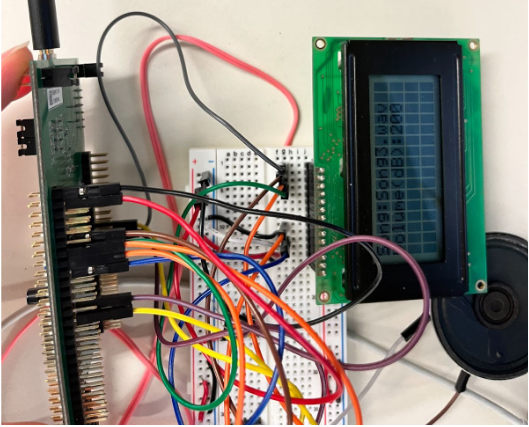
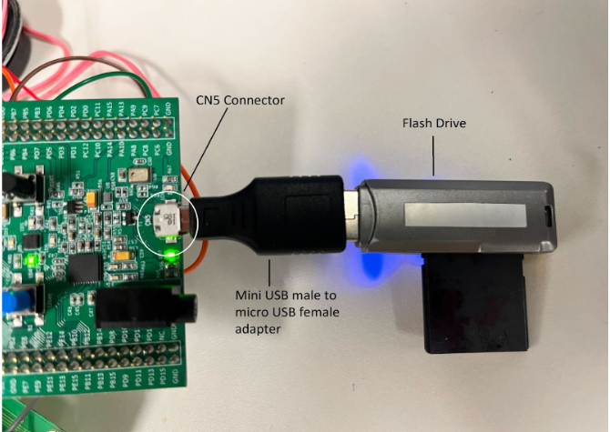
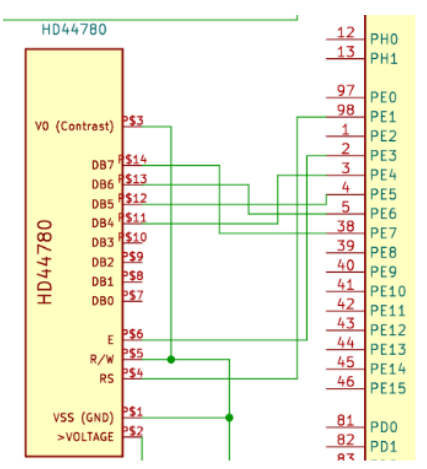
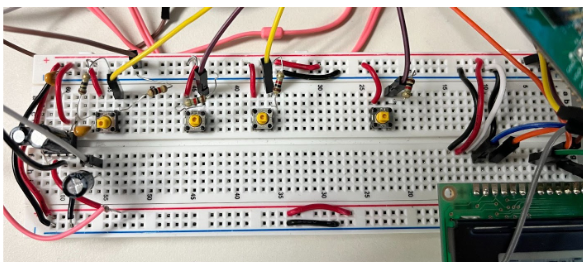
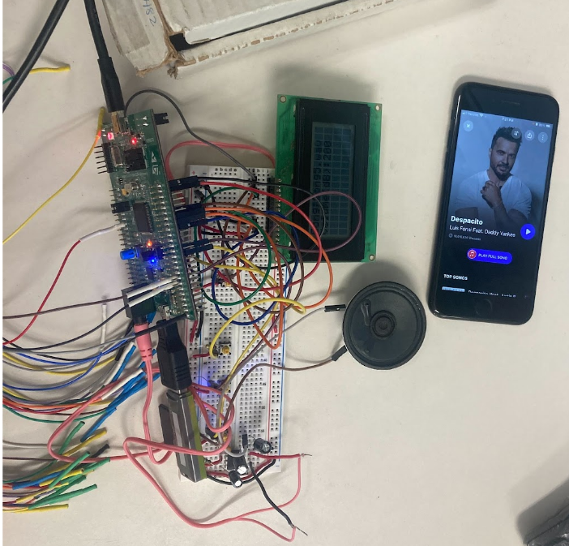

# Mini-WAV-Player

## Functionality and Brief Description

A STM32-based WAV player that reads files from a storage device and plays it out through a speaker.
Upon reset, the on-board green LED (LD4) turns on if a USB device is detected through the CN5 connector. When the on-board push button (B1) is pressed, the orange LED (LD3) turns on and a file to be played from the USB is selected based on the song index. This same push button can also be used to pause the song. The orange LED turns off after the file finishes playing and stays OFF until the next or previous song is played. 4 push-buttons have been interfaced externally for volume and song control (volume up/down, song next/previous). These push buttons toggle the blue LED (LD6) each time one of them is pressed. The song data such as the name of the song and current volume are displayed using an LCD. 

The selected song file is read from the USB flash drive and the on-chip DAC (CS43L22) is used for converting the digital audio data into an analog signal that can be output to the speaker. The registers of this Cirrus logic chip are initialized using the I2C  protocol, while the WAV data is sent using the I2S protocol. 

---

## Software & Hardware Used

- Software
    - STM32CubeIDE_1.10.1 (Build: 12716_20220707_0928 (UTC))
    - Intronix LogicPort Software build 2371 (4.8MB - released July 9, 2019)
    - Shazam
    - KiCAD 6.0.7
    - Decibel X (Version 9.5.0)

- Hardware
    - STM32F407G-DISC1 Board
    - USB Flash Drive
    - LM386 Audio Amplifier
    - Analog Speaker  
    - Digital Storage Oscilloscope (Agilent Technologies DSO-X 2022A)
    - Digital Multimeter (Agilent Technologies 34405A)
    - Intronix Logicport 34 Channel Logic Analyzer
    - Miscellaneous (Jumper wires, breadboard, pushbuttons, USB adapter. etc)

---

## BOARD DESIGN
     
### USB Drive Interface  

The CN5 connector on the discovery board is connected to the USB 2.0 Micro USB male to USB female OTG adapter. The flash drive is connected to the adapter and stores the WAV files that are used for the project. For the purpose of this project we saved 10 example .wav files and played them out through the speaker. 

As shown in the figure below, the green LED (LD7) closer to the USB connector indicates that the VBUS is active after which the plugged-in device can initiate a connect sequence. Pin 0 of port C is configured as a GPIO pin pulled low in order to power on the USB. 

### LCD Interface Design

The HD44780U LCD is used as the player display in the project. In the current design, the LCD is used to display both the song being played and the current volume of the speaker. In terms of the physical connection, the GPIO port E pins 4 to 7 are used for data bus and 1-3 are used for control signals. The following schematic illustrates such physical setting:

### Push Button Design 

GPIO pins of Port B on the STM32 board were used to connect to 4 push buttons:
* PB1 - To increase the value of the CS43L22 volume registers by 5 (with a step size of 0.5dB, increasing volume by 5 is equivalent to an increase of 2.5dB).
* PB2 - To decrease the value of the CS43L22 volume registers by 5 (decrease of 2.5 dB). 
* PB3 - To change the song index to play the next song.
* PB4 - To change the song index to play the previous song.

The push buttons were connected to external 1kΩ pull-down resistors on a breadboard. 

### Audio Jack Interface Design

A pair of earphones was initially plugged into the output of the audio jack. Eventually, we decided to strip the earbud headphones and use the right and left connectors as inputs to the amplifier, before connecting the output to the speaker. However, all the initial testing was performed on earphones.
                  

### Audio Speaker Design

The audio speaker we are using has a load resistance of 8Ω and a power requirement of 0.5W. The speaker contains no positive or negative terminals, hence one wire is connected to the output of the audio amplifier while another is grounded. 

---

## Audio Quality Analysis

The software ‘Shazam’ was used to test if the generated audio song can be identified. Specifically, we played the song `Despacito` on the mini WAV player and Shazam successfully identified the song being played as `despacito`. The following screenshot shows the moment that the song was detected:

